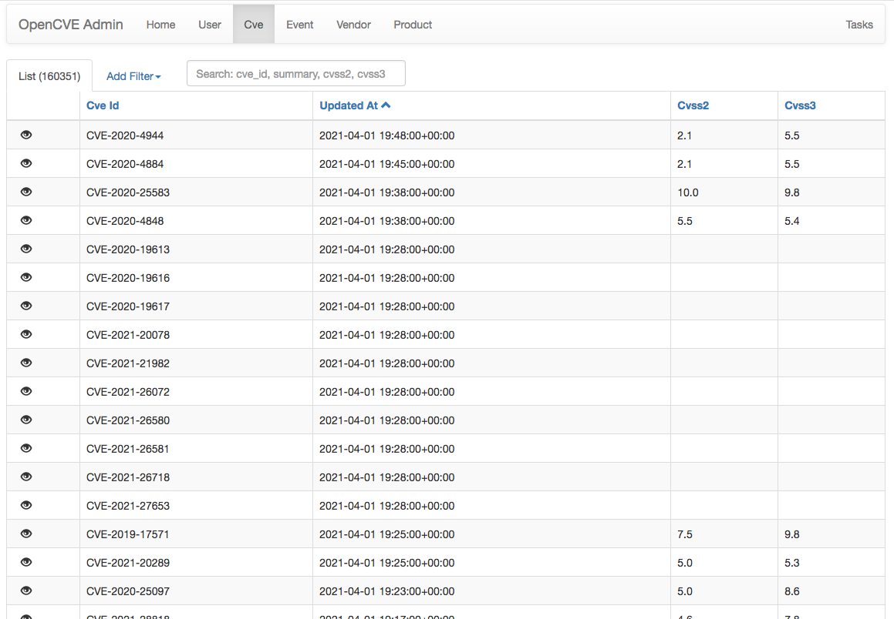
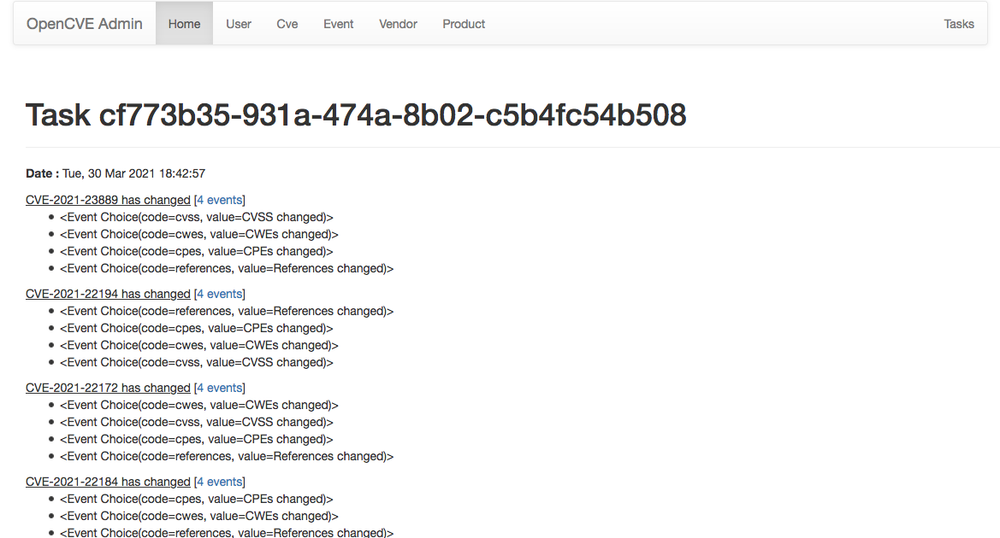
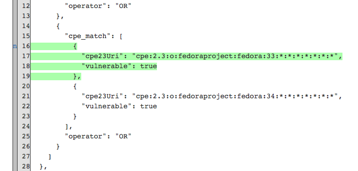

OpenCVE includes an admin section, useful to manage your instance data. The admin panel is available at *https://your_instance/admin*.

## Display Statistics

The homepage displays some global statistics :

- number of users
- number of CVEs
- number of reports
- number of vendors and products
- the date of the last task (to synchronize the data)
- the top vendors, products and reports per user
- the number of registered users per day, month or current week

{:style="width:100%"}

## Manage Objects

OpenCVE uses Flask-Admin to let you list and display the following objects :

- Users
- CVEs
- Events
- Vendors
- Products

{:style="width:100%"}

For some of them, like the users, vendors and products, it's also possible to create and update the items:

{:style="width:100%"}

## CVEs changes

When the NVD updates some CVEs, a new JSON file containing the changes is published. OpenCVE regularly parse this file and create a task containing changes.

A change is linked to a CVE and is composed of events:

{:style="width:100%"}

You can then display the visual diff of each change:

{:style="width:100%"}