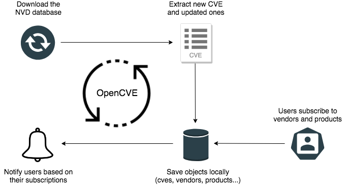
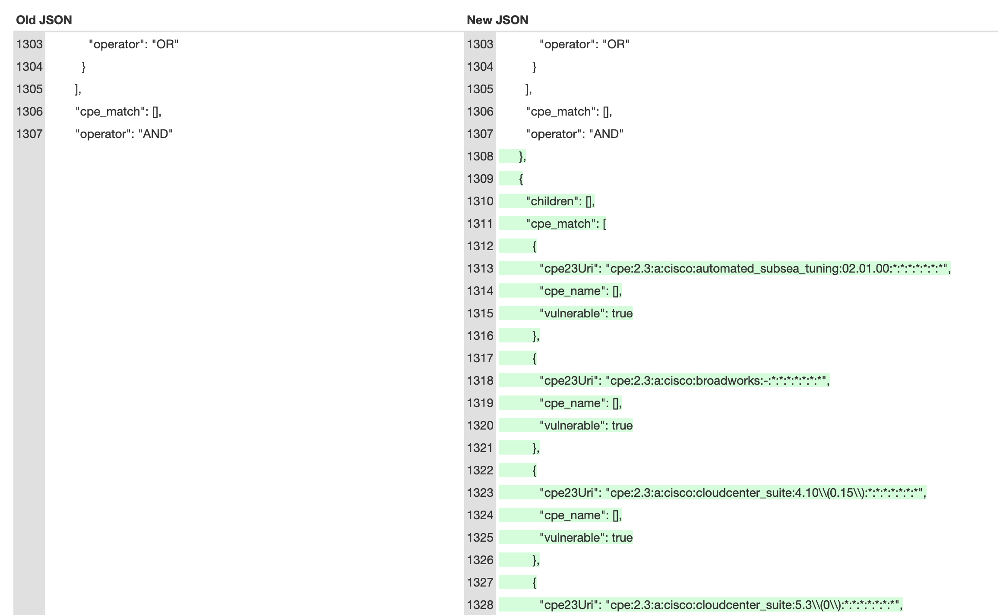
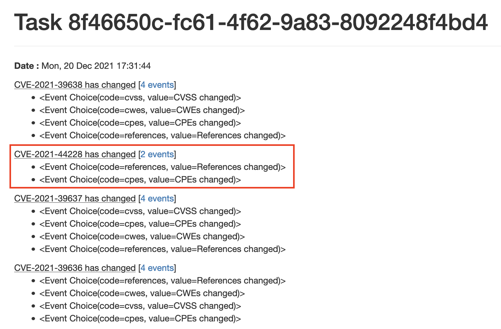
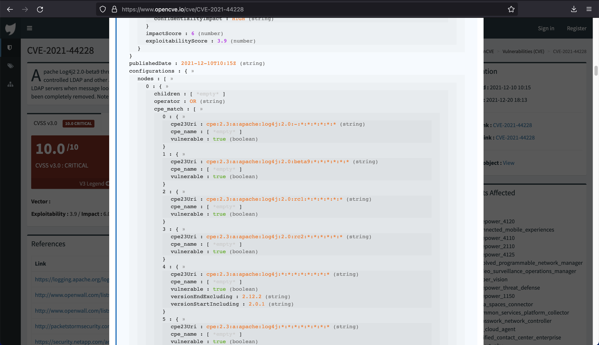
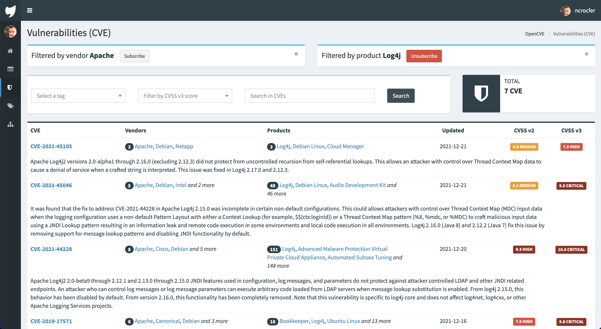

# How it Works

OpenCVE uses the [JSON feed](https://nvd.nist.gov/vuln/data-feeds#JSON_FEED) provided by the [NVD](https://nvd.nist.gov/) to update the local list of CVEs.

After an initial import, a background task is regularly executed to synchronize the local copy with the NVD feed. If a new CVE is added, or if a change is detected, the subscribers of the related vendors and products are alerted.

!!!info
    For now the only method of notification is the mail, but we work to add other integrations (webhooks, Slack, Jira, PagerDuty, OpsGenie...).

## Source of Data

The first step, if you want to install OpenCVE, is to import the whole list of CVEs, CPEs and CWEs into a local PostgreSQL database.

This is the job of the [import-data](commands.md#import-data) command.  Several files from the NVD and the MITRE are downloaded and parsed during its process:

- CPE: [https://nvd.nist.gov/feeds/xml/cpe/dictionary/official-cpe-dictionary_v2.3.xml.gz](https://nvd.nist.gov/feeds/xml/cpe/dictionary/official-cpe-dictionary_v2.3.xml.gz)
- CWE: [https://cwe.mitre.org/data/xml/cwec_latest.xml.zip](https://cwe.mitre.org/data/xml/cwec_latest.xml.zip)
- CVE:
    - [https://nvd.nist.gov/feeds/json/cve/1.1/nvdcve-1.1-2021.json.gz](https://nvd.nist.gov/feeds/json/cve/1.1/nvdcve-1.1-2021.json.gz)
    - [https://nvd.nist.gov/feeds/json/cve/1.1/nvdcve-1.1-2020.json.gz](https://nvd.nist.gov/feeds/json/cve/1.1/nvdcve-1.1-2020.json.gz)
    - [https://nvd.nist.gov/feeds/json/cve/1.1/nvdcve-1.1-2019.json.gz](https://nvd.nist.gov/feeds/json/cve/1.1/nvdcve-1.1-2019.json.gz)
    - [...]
    - [https://nvd.nist.gov/feeds/json/cve/1.1/nvdcve-1.1-2002.json.gz](https://nvd.nist.gov/feeds/json/cve/1.1/nvdcve-1.1-2002.json.gz)

Each **CVE-20xx** file is used to import all the existing CVE from 2002 (the full list of the JSON Feed can be found on the [NVD website](https://nvd.nist.gov/vuln/data-feeds#JSON_FEED)):

!!! info
    For those of you who are curious about the process of the **import-data** command, the code can be found in this folder: [https://github.com/opencve/opencve/tree/master/opencve/commands/imports](https://github.com/opencve/opencve/tree/master/opencve/commands/imports).

After this process the local PostgreSQL instance is now populated, and OpenCVE can already be used to search and list CVEs, or filter them by CWE or Vendors/Products.

## Events and Changes

New CVEs appear every day, so OpenCVE must synchronize the local database to reflect the changes.

A periodic task is scheduled every 15 minutes to check the new changes:

1. First the [meta file](https://nvd.nist.gov/feeds/json/cve/1.1/nvdcve-1.1-modified.meta) is downloaded to compare the **sha256** value with the last known in the database
2. Then, if this checksum has changed, OpenCVE downloads the [CVE-Modified](https://nvd.nist.gov/feeds/json/cve/1.1/nvdcve-1.1-modified.json.gz) file and check each CVE in it.

!!! info
    The code of this process can be found [here](https://github.com/opencve/opencve/blob/master/opencve/tasks/events.py).

For each CVE the **lastModifiedDate** field is compared with the value in the local database. If the date is not the same, it means something has changed:

- maybe it's the summary of the CVE,
- maybe a reference has been updated,
- maybe a CPE has been added,
- maybe its CVSS score changed,
- etc.

To find what has really changed, OpenCVE executes a list of **checks** (the code is [here](https://github.com/opencve/opencve/tree/master/opencve/checks)). Then it creates one or more **events**. And because a CVE can have multiple events in the same batch, these events are grouped into **changes**.

The following events are supported:

| Type       | Triggered when                     |
|------------|------------------------------------|
| new_cve    | A new CVE is created               |
| references | The references list changes        |
| cpes       | The CPE list changes               |
| cvss       | The CVSSv2 or CVSSv3 scores change |
| summary    | The summary changes                |
| cwes       | The CWE list changes               |

For instance the [CVE-2021-44228](https://www.opencve.io/cve/CVE-2021-44228) has been modified the 20 Dec 2021:

{:style="border:1px solid #ecf0f4"}

During this change, 2 events have been created (**cpes** and **references**):

{:style="border:1px solid #ecf0f4"}

Finally the change is displayed in the homepage to the end user:

!!! note
    Of course an alert is also sent to the users who suscribed to one or more vendors/products of this CVE.

## Vendors and Products

One important thing to understand when using OpenCVE is the creation of **Vendors** and **Products** from the **CPE** configurations.

Each CVE is associated to a list of configurations. For instance here is the first configurations of the [CVE-2021-44228](https://www.opencve.io/cve/CVE-2021-44228):

When this CVE is inserted in the local database, OpenCVE:

1. parses its CPE configurations
2. creates the vendors and products (especially the **apache** vendor and the **log4j** product)
3. associate them to the CVE

This schema makes it possible to filter the list of CVE based on vendors and products:

!!! note
    Initially OpenCVE used secondary relationships to fetch the list of CVE's vendors and products. But it was complicated to maintain, and the performance were poor. So it now uses the **JSONB data type** associated to the **GIN index** type, which greatly improved performance.

This system is also the core of the **subscriptions** feature:

- a CVE has associated vendors and products
- a user has associated vendors and products

So when a CVE is updated, OpenCVE just has to list its vendors and products, and alert their subscribers.
